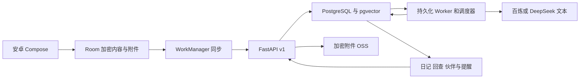

# 架构与一致性

## 组件

开发可用 SQLite / 本地加密附件；生产必须 PostgreSQL。模型调用全部在服务端。DeepSeek 用于已授权的文字测试；百炼适配转写、视觉和嵌入。安卓系统 TTS 负责按需朗读。

## 本地数据

`VaultRow(owner, kind, id, stamp, encrypted)` 保存记录、草稿、缓存、版本和删除标记。内容使用 Android Keystore AES-GCM 加密，Room 索引只含类型、UUID、归属和时间元数据。录音为 16kHz 单声道 PCM，约每秒生成一帧独立加密数据并 fsync；30 秒或暂停时封装 WAV，附件加密刷盘后再写 Room。

恢复只读取完整且认证通过的帧，忽略末尾未完成帧；附件 UUID 来自日志文件名，重试不重复添加。保存进程终止后，由启动恢复完成日志封装。照片预览和音频播放只在内存解密。

同步采用独立写锁和网络同步锁。上传完成后重新检查本地编辑，保护上传期间的新文字、附件、私密切换和删除；未同步编辑不会被拉取覆盖。关联后续按记录时间先上传原记录，再上传后续。

## 服务端对象

| 表 | 内容 |
| --- | --- |
| users | 账户、Argon2 密码散列、设置 |
| records / record_revisions | 当前记录、最初文字、时间、版本、原始修正与冲突版本 |
| attachments | MIME、哈希、加密位置、时长、转写 / 视觉缓存 |
| memories / people | 事件、外部知识、决定、结果、来源范围、向量、人物别名与确认状态 |
| record_links | 用户确认的原记录与后续 / 结果关系 |
| diaries | 同一版本的段落、时间线、手工编辑、待合并补充 |
| messages / reminders | 对话、来源、主动性、经确认的提醒状态 |
| changes / jobs | 增量同步序列、任务去重、重试、租约与错误类型 |
| usage / tombstones | 估计用量、在途预留、已删除 UUID |

迁移 `0001` 冻结首版 schema，`0002` 增加连续记录，`0003` 保存附件顺序，`0004` 增加恢复后的文字保护标记。以后追加迁移，不修改已发布迁移。

## 处理与保护

1. UUID 创建记录；相同上传返回同一版本。修改要求 `base_version`；冲突存储双方内容并返回 409。
2. 上传记录先于附件。媒体尚未到齐时延后处理，附件到达重新排队。百炼转写和图片文字缓存避免重试重复处理。
3. 事件来源必须是原文连续片段；人物名称必须在来源中出现。外部输入强制知识类型，结果关系强制结果类型。
4. 关键词用中文双字片段与英文词；百炼模式同时使用向量相似度、人物和日期筛选。生产 pgvector 计算相似度，当前适合个人数据规模，尚未做大规模吞吐验收。
5. 问答使用完整原记录作依据，避免短事件片段丢失解决过程；去重取五条，并可补充显式关联的后续来源。摘要不代替原始事实来源。
6. 模型返回引用必须属于本轮候选。网络返回后再查当前来源版本；修改 / 删除期间的答案失效，模型超时回退也执行同样检查。
7. 日记按用户时区的发生日期整理。人工段落不被重新生成覆盖。修改来源会保留人工文字并标记待核对，生成内容进入待合并列表。
8. 修改单个事件时只替换其来源片段，保留同一记录的其他事件、最初输入和修正历史。
9. 删除先写独立账本，再清理附件、历史版本、派生数据和相关任务。账本存储在 OSS / 本地存储中，与数据库备份独立。

## Worker 与预算

PostgreSQL 使用 `SKIP LOCKED` 获取任务，以条件更新绑定唯一租约 token。租约十分钟，每分钟续期；进程崩溃后可重新领取。指数退避，最多五次；失败保存一般错误类别，不保存模型响应正文。录入 / 转写 / 日记的失败不会擦除原始记录。

处理同一记录、同一天日记、同一用户伙伴消息时，独立数据库连接持有会话 advisory lock，避免预算提交期间丢失互斥。SQLite 使用进程内锁，只支持单 Worker 的开发运行。

每分钟服务端调度当地夜间日记；重启补昨天的任务；后到记录单独触发对应日期更新。20:30 后适度模式选择相关旧记忆 / 补记；周日优先周回顾。伙伴回复、周回顾和补记都受每日上限和免打扰约束，已确认提醒独立送入收件箱。手机后台通知可能延迟，打开 App 同步补齐。

模型调用前使用全局预算锁预留。成本记录只包含操作、估计费用、延迟和成功 / 失败，不含日记正文。固定费用与模型单价需要用账单修正；当前预算不是服务商实时账单。

## 信任边界

所有查询按用户隔离，引用也要校验归属。模型不提供外部工具，只能看到显式传入的当前用户来源；网页、截图、原始文本是数据，不能覆盖系统行为。网页正文抓取默认关闭；启用后只允许公共 HTTPS 地址、逐跳验证重定向、限制大小并阻断私网地址。

云端数据库存储正文，部署方必须控制数据库访问和磁盘权限。附件和备份另外加密。手机导出 / 云端导出是用户可读 ZIP，不依赖设备 Keystore；必须由用户妥善保管。
